<!-- **Malone-AI/Malone-AI** is a ✨ _special_ ✨ repository because its `README.md` (this file) appears on your GitHub profile.

Here are some ideas to get you started:
-->
- 🔭 I’m currently majoring in AI
- 🌱 I’m currently learning AI
- 👯 I’m looking to collaborate on ...
- 🤔 I’m looking for help with Linux
- 💬 Ask me about Python or Artifical Intelligence
- 📫 How to reach me: favorite.vampire@qq.com
 - 😄 Pronouns: ...
- ⚡ Fun fact: ... 

<!--
-->
<!--

<h3 align="left">🛠 Languages and tools</h3>

  
  
  
  
  
  
  
  
  

-->
